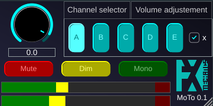

MoTo (MonitoringTool)

Moto is a VST plugin that mimic the functionalities of harware monitoring devices. It allows to distribute sound in four outputs, has mute/dim/mono buttons, and vumeters. It was developped to be included in the monitoring slot of reaper, but should be useful in other daws.

